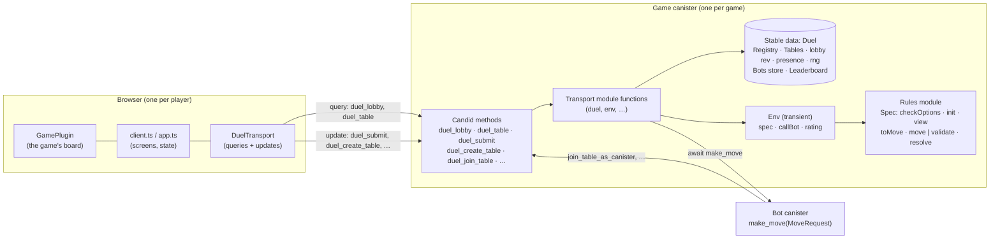
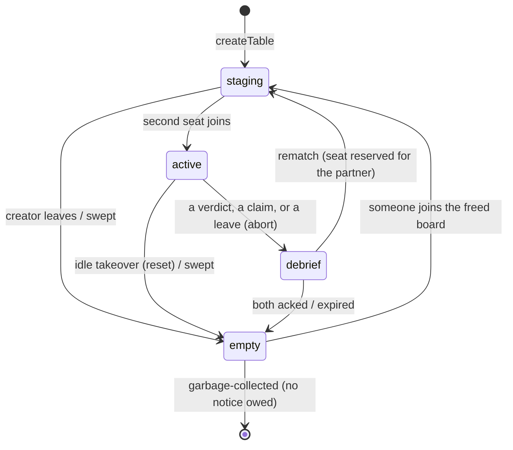
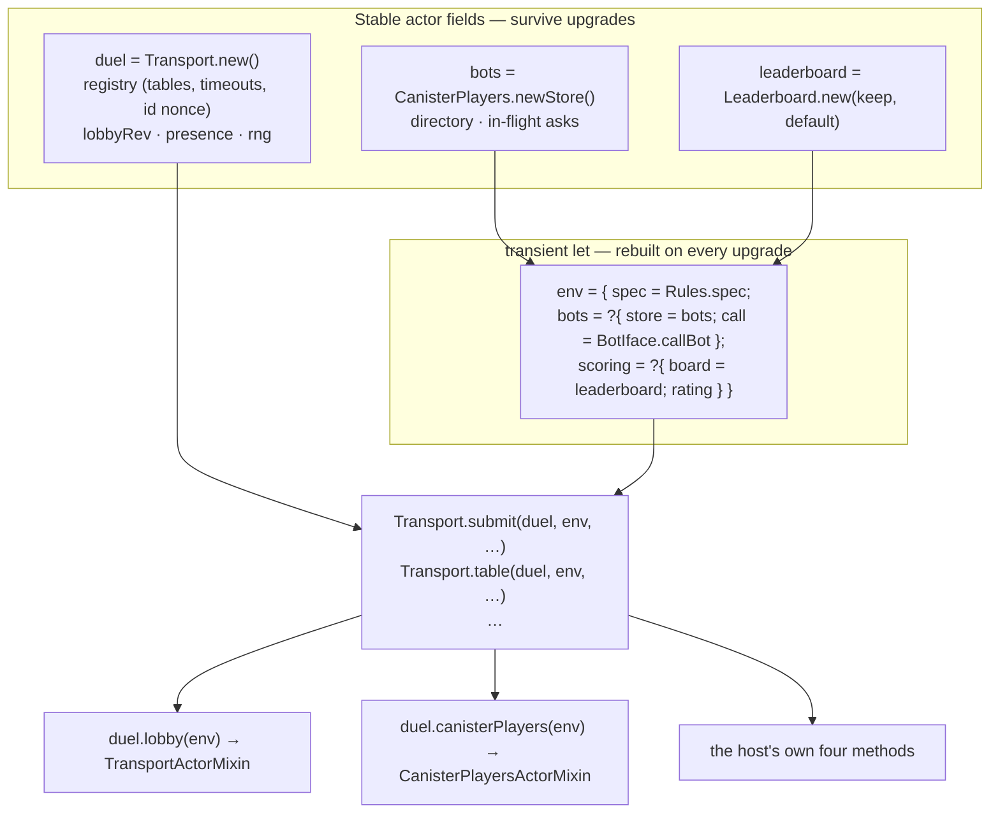
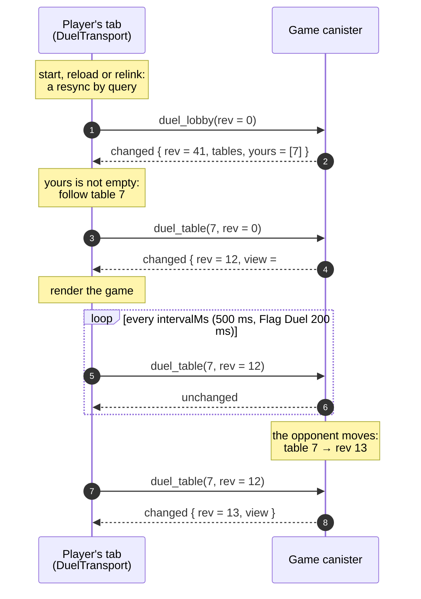
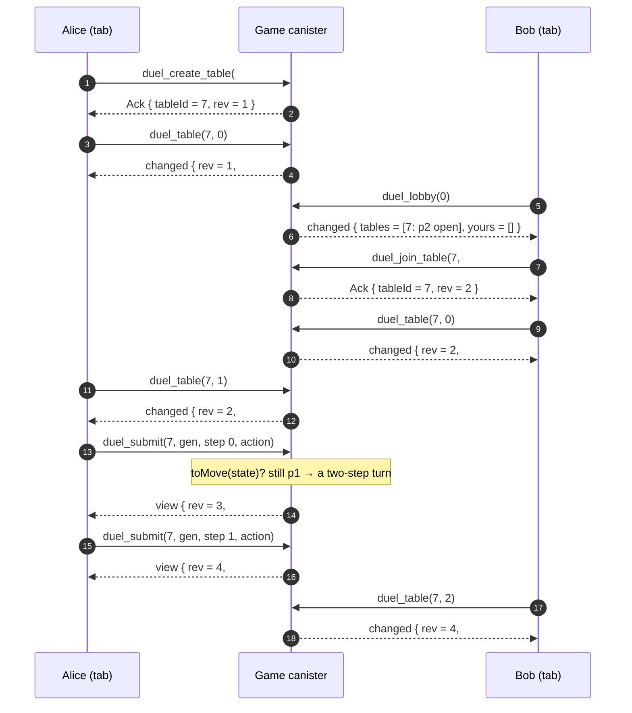
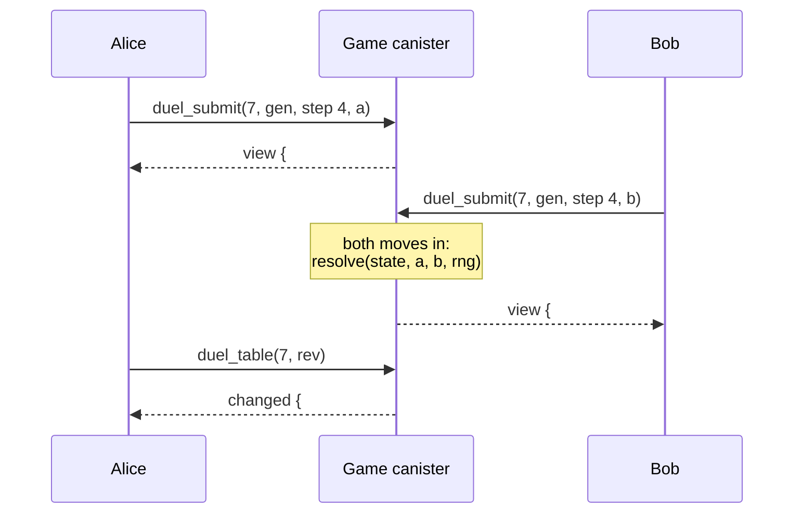
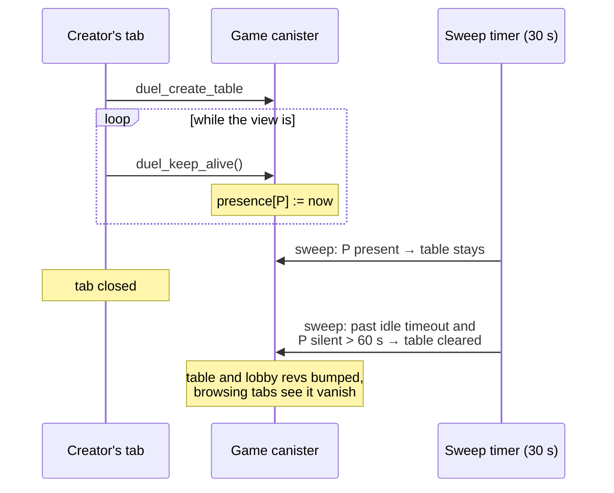
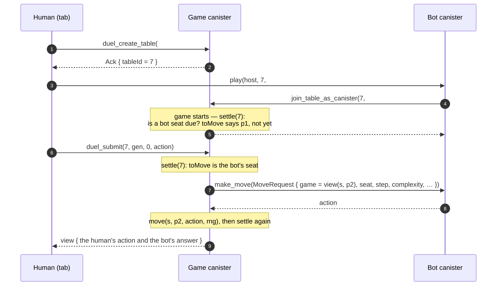
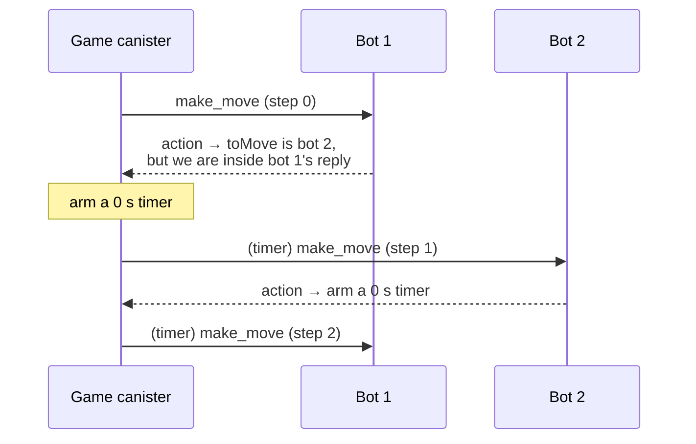

# duel-game-core — design

How the framework is put together, from the top. The package READMEs
([backend](backend/README.md), [frontend](frontend/README.md)) document
the APIs; this page explains the shape behind them and why it is that
shape.

## What it is

A game on duel-game-core is two players at a table on the Internet
Computer. The framework does everything except the game itself:
tables and seating, rounds, timeouts, endings, rematches, canister
bots, a leaderboard, and the browser client with its screens. A game
supplies a rules module — a few pure functions over its own types — and
a board to draw.



| Piece            | Where                                                   | Role                                                                    |
| ---------------- | ------------------------------------------------------- | ----------------------------------------------------------------------- |
| Rules            | the game's `XRules.mo`                                  | `Spec<S, M, V, O>`: options, init, view, and the moves. Pure.           |
| Table            | `backend/src/table.mo`                                  | One board: phases, rounds, timeouts, rematch, claim.                    |
| Registry         | `backend/src/registry.mo`                               | Many tables; who is at which.                                           |
| Transport        | `backend/src/transport.mo` + `transport_actor_mixin.mo` | The only client interface: revs, queries, mutations, keep-alive, sweep. |
| Canister players | `backend/src/canister_players.mo` + mixin               | Bots as players; the bot directory.                                     |
| Leaderboard      | `leaderboard.mo`, `elo.mo` + mixin                      | Optional scores (Elo or a game's best).                                 |
| HTTP             | `http_actor_mixin.mo`                                   | `/semantics`, `/wasm`, `/metrics`.                                      |
| Client           | `frontend/src/*`                                        | Transport, headless client, default screens, identity.                  |

## What a game supplies

A rules module exports four types and a handful of pure functions, and
bundles the functions as a constant `spec`:

| Type | Meaning                                                                                                       |
| ---- | ------------------------------------------------------------------------------------------------------------- |
| `S`  | the full game state — what the canister keeps                                                                 |
| `M`  | one action a seat submits                                                                                     |
| `V`  | what one seat may see of the state: `S` minus anything hidden from that seat (`V = S` when nothing is hidden) |
| `O`  | the table's options, picked by its creator (`{}` when there are none; a variant or a record with parameters)  |

```motoko
public type Spec<S, M, V, O> = {
  #turnBased : {
    checkOptions : (O) -> ?Text; // null = sensible; ?why = refuse to open the table
    init : (O, Rng) -> S;
    toMove : (S) -> Seat; // whose action the game is waiting for
    move : (S, Seat, M, Rng) -> {
      #ok : { state : S; verdict : ?Verdict };
      #err : Text;
    };
    view : (S, Seat, Bool) -> V; // the Bool: the game is over
  };
  #simultaneous : {
    checkOptions : (O) -> ?Text;
    init : (O, Rng) -> S;
    validate : (S, Seat, M) -> ?Text; // only checks a submission
    resolve : (S, M, M, Rng) -> { state : S; verdict : ?Verdict };
    view : (S, Seat, Bool) -> V;
  };
};

```

Two modes, because they resolve differently:

- **Turn-based.** One seat acts at a time, and the rules decide who:
  `toMove(s)` reads it off the state, so a turn may take several
  actions (Rack-O: draw, then place), an action may grant another turn
  (a rolled six, an UNO "go again"), and the order is the game's own —
  which is also what a third seat will need. The engine only refuses a
  seat `toMove` does not name (`#notYourTurn`). `move` checks and applies
  one action in a single call: checking often means computing the
  effect anyway.
- **Simultaneous.** Both seats act every step. A submission is checked
  at once (`validate`) but applied only when both are in (`resolve`).

**Hidden information.** The canister keeps `S`, but nothing ever leaves
it except through `view(s, seat, over)`: the in-game view a client
polls, the debrief's final view, and what a bot is asked with. A game
decides what each seat sees — Rack-O hides the opponent's rack and the
draw pile, and reveals a drawn card only to the seat that drew it. The
flag `over` is set once the game has ended by a verdict, a leave or a
claim, so a game may reveal everything in the debrief without having to
record "over" in its state.

**Options.** A table is opened with a typed `O`, listed in the lobby
with it, and `init` builds the first state from it. The game's
`checkOptions` decides whether the value is sensible (rock-paper-
scissors accepts `winsNeeded` from 1 to 9); a rejected value never
opens a table (`#badOptions`).

**Randomness.** The framework keeps one random-number generator per
game canister, in the stable data, and hands it to `init`, `move` and
`resolve`. A rules module draws from it (`rng.below(n)`,
`rng.shuffle(xs)`) and holds no generator of its own; tests pass a
seeded one for reproducible games.

## Core concepts

**Player.** A player is the principal that signs the call. Nothing else
identifies anyone: no method takes a session id, and the anonymous
principal is refused (`#unauthorized`). A browser player is a key the
tab generates (or an Internet Identity login); a bot is
`cp:<principal>:<complexity>`, so one bot canister may play in several
styles, even against itself. Inside the engine a player is a `PlayerId`
(`Text`), compared only for equality.

**Table.** A table has an id (never reused) and a phase:



Each phase carries a timestamp, so nothing waits forever: an idle game
can be taken over, a debrief expires, and a waiting table whose creator
went silent is swept. A player evicted that way gets an `#endedByOther`
notice until they acknowledge it.

**View.** What one player sees of one table: `#stagingYou`,
`#awaitingRematch`, `#inGame`, `#debrief`, `#endedByOther` for a player
with business there, `#lobby`/`#busy` for an outsider. Views never
contain the opponent's pending move, only whether one exists.

**Rev.** Every table has a counter, `rev`, bumped on every change, and
so does the lobby. A client that sends the `rev` it holds gets
`#unchanged` until something changed — the whole cost of polling an
idle table is one counter comparison.

**Several tables.** A player may sit at up to
`MAX_TABLES_PER_PLAYER` (3) tables at once; every table request names
its table. Which tables are a player's is read off the tables
themselves (`Registry.tablesOf`), never kept separately.

## Data and behaviour

Everything the game canister knows is stable data in plain records,
declared as ordinary actor fields. Behaviour is module functions. There
are no classes: the function values Motoko cannot store — the game's
`spec`, the bot call, a rating rule — travel in a small transient
`Env` record the host builds once and passes to every call.



The only function values are those that have to be code, and they
reach the framework as arguments, never as stored state:

- **`spec`** — the game's rules. The framework is generic over the
  game's types and is type-checked once, on its own, so it cannot name
  `Rules.move`; the host, which imports `Rules`, passes the functions
  in. (Motoko's dot notation and implicit arguments are resolved where a
  call is written, so they could only shorten the host's calls, not
  replace this.)
- **`callBot`** — the inter-canister call to a bot's `make_move`. A call
  returning a generic `M` does not type-check inside the library, so it
  lives in the game's `BotIface.mo`, where `M` is concrete.
- **`rating`** — `#elo { k }`, or a game's own `#best` function that
  scores the seats a finished game credits (racing turns a lap time
  into a score; Flag Duel records each player's correct answers).

**Why the host declares four methods.** A mixin cannot take type
parameters, so every method whose Candid signature names a game type is
the host's own one-line pass-through: `duel_create_table` and
`duel_lobby` (the options), `duel_submit` (an action in, a view out) and
`duel_table` (a view out). Everything else comes from the mixins.

```motoko
public shared ({ caller }) func duel_submit(tableId : TP.TableId, gen : Nat, step : Nat, action : Rules.Action) : async Transport.Reply<Rules.View> {
  duel.reply(env, caller, tableId, await* duel.submit<system, Rules.State, Rules.Action, Rules.View, Rules.Options>(env, caller, tableId, gen, step, action));
};

public shared query ({ caller }) func duel_table(tableId : TP.TableId, rev : Nat) : async Transport.TableResult<Rules.View> {
  duel.table(env, caller, tableId, rev);
};

```

`submit` and `reply` are two steps because an `async*` result must be a
shared type, which the generic `Reply<V>` is not: `submit` does the
work and returns only `?Err`; `reply` builds the view synchronously.

**Upgrades.** Tables, ratings, bot registrations and the random
generator survive an upgrade untouched. The `Env` is rebuilt from the
rules module, polling clients notice nothing, and timeouts are
re-applied from the source on the line after the declaration
(`duel.registry.setTimeouts(...)`).

## Reading: queries and revs

All reading is by query; a query changes nothing and records nothing
about who asked. The client follows one source at a time: the lobby, or
one of its tables.



The transport falls back to the lobby when its table answers `#gone`
or shows the player an outsider's view (`#lobby`/`#busy`), and moves to
a table when the lobby lists one in `yours` — so another player's
action that ends your game, or a sweep, is followed without any special
message.

Why there is no per-reader state on the canister: a query cannot write
anything, so any "link" or "session" record would need an extra update
call just to exist and to stay alive. Versioning the shared data (each
table, the lobby) instead makes every read a pure query from the first
request on. Queries go to one replica and may briefly lag the latest
update; revs make that harmless, because a client never applies a view
older than one it has.

## Writing: one request at a time

Two update calls in flight have no guaranteed order on the IC, so the
client sends one request, waits for its reply, then sends the next.
That is what makes "move, then claim" or "leave, then create" mean what
the player meant; the canister itself never queues anything.

There are two kinds of reply:

- **`duel_submit`** replies with the table's fresh view — the action
  applied, and against a bot, the bot's answer too. In a turn-based game
  the view says whose turn it is next (`toMove`), so a client needs no
  poll to learn that it stays on turn after a draw or a repeat turn.
- **Every other mutation** (`duel_create_table`, `duel_join_table`,
  `duel_rematch`, `duel_leave`, `duel_reset`, `duel_claim_win`,
  `duel_ack_ended`) replies with an `Ack`: the table and its `rev` after
  the call. The client then polls that table until its view has reached
  that `rev`. These calls are not on the hot path (starting a game can
  afford one poll), and keeping them free of the game's types is what
  lets a non-generic mixin supply them.

**Steps, not turns.** The engine counts `step`: every applied action in
a turn-based game, every resolved round in a simultaneous one. A client
stamps the step it saw on each submit, which is what makes replays
detectable. What a _turn_ is — Rack-O's draw-then-place is one turn and
two steps — only the game knows, so a game that wants to show turns
counts them in its own state.

A turn-based game between two browsers:



A `#simultaneous` round: each seat submits; the second submission
resolves the round and comes back with the resolved state; the first
submitter sees it on its next poll.



**Replay safety.** A call that throws may or may not have landed, so
the client resends it (twice, to the same table). `submit`, `leave`,
`reset` and `claimWin` carry the `gen` (match generation) and `submit`
the `step` the client last saw; a replay against a later step or a new
match is `#stale`, and on a resend the client settles with a resync
instead of showing an error.

## Waiting tables: keep-alive and sweep

A table whose creator is waiting for an opponent would otherwise sit in
the lobby forever after the tab closes. While the shown view is
`#stagingYou`, the client sends `duel_keep_alive()` every 20 s
(`KEEP_ALIVE_SECS`). It records the caller's presence and nothing else.
Every 30 s (`SWEEP_SECS`) the sweep clears a waiting table that is past
the idle timeout and whose creator has not been heard from for 60 s
(`PRESENCE_TTL_NS`), along with expired games and debriefs.



Silence never ends a game in progress: departure there is the engine's
own business — `claimWin` once the opponent has been silent past
`claimTimeoutNs`, or idle takeover after `idleTimeoutNs`. A player who
closes the tab and comes back with the same key continues where they
were.

## Canister players

A bot is a canister that implements `make_move(MoveRequest<V, M>) :
async M`. It is asked with the game's `view` for its seat — the same
thing a human at that seat sees — so a bot is fair by construction: it
cannot read the opponent's hand or an undrawn card, because they are
not in the request. The game canister calls it and treats the reply as
the move —
an `await` is an ordered request/response channel, so the bot never
makes a second, unordered call into the game. After every mutation the
transport settles the table: it asks a due bot, claims an overdue win
for a waiting one, and acknowledges a finished debrief for a bot whose
partner is gone or is itself a bot.



An illegal reply is retried once, with `retryReason` set to the rules'
rejection text; a trap or rejection is treated as silence and left to
the timeouts. A bot still on turn after its own action (a multi-step
turn, an extra turn) is asked again from a fresh message, and two bots
at one table never play a whole match inside one call: a bot seat that
becomes due inside the other bot's reply is asked through a zero-second
timer.



Bots register themselves in the game's directory (`register_bot`), and
frontends list them (`list_bots`) with their ratings, so a human can
challenge one without knowing its id.

## Leaderboard

Optional, and each game picks the kind that fits. A finished game is
scored by the transport when it sees a fresh debrief: `#elo { k }` is a
rating between players who play against each other (claimed and
aborted games count as wins for the other seat); `#best pick` is for
individual results — the game returns a score for each seat it credits
(racing: the winner's lap; Flag Duel: both players' correct answers),
each kept only when it improves that player's personal best. Keys are
player ids, so a bot is rated per complexity. `get_leaderboard()` comes
from `LeaderboardActorMixin`.

## HTTP

`HttpActorMixin` serves plain-text routes: `/semantics` (the rules,
written for someone without the source — the contract a third-party
frontend or bot is built from), `/metrics` (promtracker), anything a
game adds, and `/wasm`, the exact module the canister runs, uploaded
by the deploy. Together with the Candid metadata, that is everything
needed to build and test a new frontend or bot from the canister id
alone.

## Guarantees

1. **Race-free rematch.** The rematch stages the same table with the
   other seat reserved for the partner; their `rematch`/`join` fills
   it, their `leave` declines it.
2. **No ghost tables.** Every phase is timestamped; idle tables are
   taken over or swept, and empty ones are garbage-collected.
3. **Server-side legality.** `validate` runs on every submission.
4. **No silent endings.** `#aborted`, `#claimed`, `#endedByOther`.
5. **Leave means left.** Once a player acknowledged a debrief, the
   table is no longer theirs.
6. **Replay-safe.** `gen`/`step` mismatches are `#stale`.
7. **Ordered requests.** One update at a time per client.
8. **Cheap idle reads.** An unchanged table or lobby costs one counter
   comparison; nothing is stored per reader.
9. **Nothing lost on upgrade.** All data is stable; only the `Env` is
   rebuilt.
10. **Hidden information stays hidden.** Every view, for a client or a
    bot, goes through the game's `view`; the full state never leaves
    the canister.
11. **No class, no stored functions.** The game's functions arrive with
    each call; the stable data holds only data.

## Where to go next

- Build a game from a rules description: [the skill](skills/duel-game-core/SKILL.md).
- Backend API: [backend/README.md](backend/README.md).
- Frontend API: [frontend/README.md](frontend/README.md).
- A frontend or bot for a deployed game:
  [frontend-for-existing-game.md](skills/duel-game-core/references/frontend-for-existing-game.md),
  [bot-for-existing-game.md](skills/duel-game-core/references/bot-for-existing-game.md).
- Repo conventions and rules for contributors: [CLAUDE.md](CLAUDE.md).
